[](https://www.npmjs.com/package/camouf)
[](https://www.npmjs.com/package/camouf)
[](https://opensource.org/licenses/Apache-2.0)
[](https://github.com/TheEmilz/camouf/actions/workflows/ci.yml)
[](https://github.com/marketplace/actions/camouf-architecture-guardrails-for-ai-generated-code)

# Camouf

> **Camouf catches the mistakes AI coding assistants make** — broken contracts, phantom imports, signature drift, and architectural violations that traditional linters miss entirely.

---

## The Problem: AI Agents Forget Context

Claude, Copilot, and Cursor are brilliant at generating code — but they work with **limited context windows**. When an AI generates frontend code without seeing your backend contracts, or modifies a file without remembering related files, things break in ways that **compile but fail at runtime**:

```typescript
// Backend contract (shared/api.ts)
export function getUserById(id: string): Promise<User> { ... }
export interface User { email: string; createdAt: Date; }

// AI generates frontend code (components/Profile.tsx) — looks correct, compiles fine
const user = await getUser(userId);        // ❌ Wrong function name
console.log(user.userEmail);               // ❌ Wrong field name
console.log(user.created_at);              // ❌ Wrong casing
```

**ESLint doesn't catch this.** TypeScript passes. Your tests might even pass. Then production breaks.

---

## How Camouf Solves It

Camouf scans your codebase for the **specific patterns of errors** that AI assistants create:

<p align="center">
  <a href="https://raw.githubusercontent.com/TheEmilz/camouf/master/docs/images/problem-flow.svg" target="_blank">
    
  </a>
</p>

### What Camouf Catches

| Error Type | Example | Traditional Tools |
|------------|---------|-------------------|
| **Function Name Drift** | `getUser()` instead of `getUserById()` | ❌ ESLint ignores it |
| **Phantom Imports** | `import { validate } from './helpers'` (file doesn't exist) | ❌ TypeScript ignores at lint time |
| **Field Name Mismatch** | `user.userEmail` instead of `user.email` | ❌ Compiles with `any` |
| **Context Drift** | Same concept named `User`/`Customer`/`Account` in different files | ❌ No tool detects this |
| **Orphaned Functions** | AI generates helpers that are never called | ❌ Tree-shaking hides it |
| **Casing Inconsistency** | `getUserById` / `get_user_by_id` in same project | ❌ Style issue, not error |

### Detection Example

```
Defined in shared/api.ts:15      Used in frontend/user.ts:42
         getUserById(id)    ◄──────────    getUser(userId)
                                  └── 75% similar — likely AI context loss
```

### Quick Fix

```bash
npx camouf fix-signatures --all    # Fix all mismatches automatically
npx camouf fix --id sig-001        # Fix a specific mismatch
```

<p align="center">
  <a href="https://raw.githubusercontent.com/TheEmilz/camouf/master/docs/images/camouf-workflow.svg" target="_blank">
    
  </a>
</p>

---

## Traditional Linters vs Camouf

| Aspect | ESLint / Prettier | Camouf |
|--------|-------------------|--------|
| **Focus** | Code style, syntax errors | Cross-file contract integrity |
| **Scope** | Single file at a time | Entire codebase relationships |
| **AI Errors** | Doesn't detect | Purpose-built for AI mistakes |
| **Runtime Safety** | No guarantee | Catches compile-but-fail bugs |
| **Architecture** | No awareness | Layer boundaries, DDD, dependencies |

**Camouf is not a replacement for ESLint** — it catches what ESLint can't see.

---

## Why Camouf?

- **AI-Native**: Built specifically for Claude, Copilot, and Cursor error patterns
- **Cross-File Analysis**: Detects mismatches across your entire codebase
- **Plugin Architecture**: Extend with custom rules for React, Next.js, NestJS, or any framework
- **Multi-language Support**: TypeScript, JavaScript, Python, Java, Go, Rust
- **CI/CD Ready**: SARIF, JSON, JSOND outputs for GitHub Actions and AI agents
- **VS Code Integration**: Real-time Problems panel with clickable fixes

<p align="center">
  <a href="https://raw.githubusercontent.com/TheEmilz/camouf/master/docs/images/architecture-overview.svg" target="_blank">
    
  </a>
</p>

---

## Features

- **19 Built-in Rules**: AI-specific and architecture validation rules
- **Function/Field Matching**: Fuzzy matching to detect AI naming drift
- **Circular Dependency Detection**: Find and break dependency cycles
- **Real-time Watch Mode**: Continuous architecture monitoring
- **Security Scanning**: Detects hardcoded secrets, API keys, credentials
- **Multiple Report Formats**: HTML, JSON, JSOND, Markdown, SARIF
- **VS Code Integration**: Problems panel with clickable quick-fixes
- **Plugin System**: Extend for any framework (React, Next.js, NestJS...)

---

## Quick Start

### Installation

```bash
npm install -g camouf
# or
npm install --save-dev camouf
```

### Initialize

```bash
camouf init
```

### Validate

```bash
camouf validate
```

### Watch Mode

```bash
camouf watch
```

---

## CLI Reference

Running `npx camouf` or `npx camouf help` displays the full interactive help:

```
  ██████╗ █████╗ ███╗   ███╗ ██████╗ ██╗   ██╗███████╗
 ██╔════╝██╔══██╗████╗ ████║██╔═══██╗██║   ██║██╔════╝
 ██║     ███████║██╔████╔██║██║   ██║██║   ██║█████╗
 ██║     ██╔══██║██║╚██╔╝██║██║   ██║██║   ██║██╔══╝
 ╚██████╗██║  ██║██║ ╚═╝ ██║╚██████╔╝╚██████╔╝██║
  ╚═════╝╚═╝  ╚═╝╚═╝     ╚═╝ ╚═════╝  ╚═════╝ ╚═╝    v0.10.0

  Architecture guardrails for AI-generated code

  ┌─────────────────────────────────────────────────────────────┐
  │  QUICK START                                                │
  │                                                             │
  │  $ npx camouf init              # Setup config              │
  │  $ npx camouf validate          # One-time check            │
  │  $ npx camouf watch             # Real-time monitoring      │
  └─────────────────────────────────────────────────────────────┘

  COMMANDS

  Setup & Config:
    init [options]            Initialize configuration in the current project
                              --template <t>  Use preset (monorepo, fullstack)
                              --agent <type>  Generate CLAUDE.md / AGENTS.md
                              --plugin        Scaffold a new Camouf plugin project

  Validation & Analysis:
    validate [options]        One-time architecture validation
                              --rules <r>     Run specific rules (comma-sep)
                              --format <f>    Output: text, json, sarif, vscode
                              --fix           Auto-fix where possible
                              --ci            CI/agent mode (no spinners)
    watch [options]           Real-time file monitoring with live validation
                              --format vscode VS Code Problems panel integration
                              --rules <r>     Watch specific rules only
    analyze [options]         Deep architecture & dependency analysis
                              --metrics       Include code metrics
                              --coupling      Analyze module coupling
                              --format <f>    Output: html, json, dot

  Fixing & Refactoring:
    fix [options]             Fix signature mismatches & fixable violations
                              --interactive   Review and confirm each fix
                              --all           Apply all fixes automatically
                              --dry-run       Preview changes without applying
                              --id <id>       Fix specific mismatch by ID
                              --file <path>   Fix all in a specific file
                              --type <type>   Fix by type (function-name, etc.)
    fix-signatures [options]  Alias: fix function signature mismatches

  Reporting:
    report [options]          Generate comprehensive architecture reports
                              --format <f>    html, pdf, json, markdown
                              --include-code  Include code snippets
                              --include-graphs Include dependency graphs

  AI Agent Integration:
    mcp [options]             Start MCP server for Cursor, Claude, Copilot
                              --stdio         Use stdio transport (default)

  GLOBAL OPTIONS

    -c, --config <path>       Path to configuration file
    -v, --version             Display current version
    --verbose                 Enable verbose output
    --silent                  Suppress all output except errors
    --no-color                Disable colored output

  EXAMPLES

    $ npx camouf validate --format json          # JSON output for scripts
    $ npx camouf validate --rules function-signature-matching
    $ npx camouf fix --interactive               # Review fixes one by one
    $ npx camouf fix --all --dry-run             # Preview all fixes
    $ npx camouf watch --format vscode           # VS Code integration
    $ npx camouf report --format html            # HTML architecture report
    $ npx camouf init --agent claude             # Generate CLAUDE.md
    $ npx camouf mcp --stdio                     # Start MCP server

  AVAILABLE RULES

    AI Safety:          ai-hallucinated-imports, inconsistent-casing,
                        orphaned-functions, phantom-type-references,
                        context-drift-patterns, async-discrepancies
    Architecture:       layer-dependencies, circular-dependencies,
                        function-signature-matching, contract-mismatch
    Code Quality:       type-safety, performance-antipatterns,
                        data-flow-integrity, hardcoded-secrets
    Advanced:           ddd-boundaries, distributed-transactions,
                        api-versioning, security-context, resilience-patterns

  DOCS & LINKS

    Documentation:      https://github.com/TheEmilz/camouf#readme
    Report Issues:      https://github.com/TheEmilz/camouf/issues
```

> **Tip:** Run `npx camouf help <command>` for detailed help on any specific command.

---

## Plugin System

Extend Camouf for any framework. Plugins can add rules, analyzers, parsers, quick-fixes, and output formatters.

```bash
npm install --save-dev camouf-plugin-react
```

```json
{
  "plugins": ["camouf-plugin-react"],
  "rules": {
    "plugin": {
      "missing-dependency-array": "error"
    }
  }
}
```

See [Creating Plugins](docs/creating-plugins.md) for building your own.

---

## Official Plugins

| Plugin | Description | Status |
|--------|-------------|--------|
| [`camouf-plugin-react`](https://www.npmjs.com/package/camouf-plugin-react) | React hooks dependency arrays, component naming, prop drilling, stale closures | ✅ Available |
| `camouf-plugin-nextjs` | Next.js page structure, API routes, middleware | 🔜 Coming Soon |
| `camouf-plugin-nestjs` | NestJS module boundaries, DI patterns | 🔜 Coming Soon |

### camouf-plugin-react

Catches AI-generated React mistakes:

```bash
npm install --save-dev camouf-plugin-react
```

**Rules included:**

| Rule | Description |
|------|-------------|
| `missing-dependency-array` | Detects useEffect/useCallback with missing dependencies |
| `inconsistent-component-naming` | Enforces PascalCase for React components |
| `prop-drilling-detection` | Finds excessive prop passing through component trees |
| `stale-closure-patterns` | Catches stale closures in hooks (common AI mistake) |

---

## MCP Server (AI Agent Integration)

Camouf exposes an **MCP (Model Context Protocol) server** that allows AI agents like Claude, Cursor, and Copilot to validate their own code **before proposing it to you**.

> **Full tutorial:** [Using Camouf with AI Agents (MCP Tutorial)](docs/mcp-agent-tutorial.md) -- setup, real-time streaming, multi-agent collaboration, and the validate-fix-revalidate loop.

### Start MCP Server

```bash
npx camouf mcp
```

### Claude Desktop Configuration

Add to your Claude Desktop config (`%APPDATA%\Claude\claude_desktop_config.json` on Windows, `~/Library/Application Support/Claude/claude_desktop_config.json` on macOS):

```json
{
  "mcpServers": {
    "camouf": {
      "command": "npx",
      "args": ["camouf", "mcp"],
      "cwd": "/path/to/your/project"
    }
  }
}
```

### Available MCP Tools

| Tool | Description |
|------|-------------|
| `camouf_validate` | Validate code against architecture rules |
| `camouf_analyze` | Analyze project structure and dependencies (uses real dependency graph) |
| `camouf_suggest_fix` | Get fix suggestions for violations |

### MCP Resources

| Resource | Description |
|----------|-------------|
| `camouf://rules` | All available rules with enabled/disabled status (dynamic from config + plugins) |
| `camouf://config` | Active project configuration, layers, and rule settings |

### MCP Prompts

| Prompt | Description |
|--------|-------------|
| `before-writing-code` | Workflow: analyze project architecture before generating code |
| `after-generating-code` | Validate and fix loop with max 3 iterations |
| `understanding-violations` | How to interpret severity levels and common AI violations |
| `project-conventions` | Discover active rules, layers, naming conventions |

### Example: AI Self-Validation

When Claude generates code, it can call `camouf_validate` to check for:

- Hallucinated imports (modules that don't exist)
- Contract mismatches (wrong function signatures)
- Context drift (inconsistent naming)
- Security issues (hardcoded secrets)

This creates a **feedback loop** where AI catches its own mistakes before you see them.

---

## Documentation

- [Getting Started](docs/getting-started.md)
- [Creating Plugins](docs/creating-plugins.md)
- [AI Agent Challenges](docs/ai-agent-challenges.md)
- [MCP Agent Tutorial](docs/mcp-agent-tutorial.md)
- [Configuring Rules](docs/configuring-rules.md)
- [Async Discrepancies Guide](docs/async-discrepancies.md)
- [CI/CD Integration](docs/ci-cd-integration.md)
- [Changelog](CHANGELOG.md)

---

## Commands

> See the full [CLI Reference](#cli-reference) above for all commands, options, and examples.
> 
> Run `npx camouf help` to see the same reference in your terminal.

<!-- Detailed command docs removed — see CLI Reference section above -->

## Configuration

### Configuration File

Camouf supports multiple configuration formats:
- `camouf.config.json`
- `camouf.config.yaml`
- `camouf.config.js`
- `.camoufrc`

### Example Configuration

```json
{
  "name": "my-project",
  "rootDir": "./src",
  "exclude": ["**/node_modules/**", "**/*.test.ts"],
  "layers": [
    {
      "name": "presentation",
      "directories": ["./src/controllers", "./src/routes"],
      "allowedDependencies": ["application", "domain"]
    },
    {
      "name": "application",
      "directories": ["./src/services", "./src/usecases"],
      "allowedDependencies": ["domain"]
    },
    {
      "name": "domain",
      "directories": ["./src/domain", "./src/entities"],
      "allowedDependencies": []
    },
    {
      "name": "infrastructure",
      "directories": ["./src/infrastructure", "./src/repositories"],
      "allowedDependencies": ["domain"]
    }
  ],
  "rules": {
    "builtin": {
      "layer-dependencies": "error",
      "circular-dependencies": "error",
      "function-signature-matching": "error",
      "performance-antipatterns": "warn",
      "type-safety": "warn",
      "data-flow-integrity": "error",
      "distributed-transactions": "warn",
      "api-versioning": "info",
      "security-context": "error",
      "resilience-patterns": "warn",
      "ddd-boundaries": "info"
    }
  },
  "output": {
    "format": "text",
    "colors": true,
    "verbose": false
  }
}
```

## Built-in Rules

### Architecture Rules

| Rule | Description | Default |
|------|-------------|---------|
| `layer-dependencies` | Validates layer boundary compliance | `error` |
| `circular-dependencies` | Detects circular dependency cycles | `error` |
| `contract-mismatch` | Validates API contracts (OpenAPI/GraphQL) | `error` |
| `ddd-boundaries` | Validates DDD principles and bounded contexts | `warn` |
| `function-signature-matching` | Detects mismatched function/field names between contracts and usage | `error` |

### Security Rules

| Rule | Description | Default |
|------|-------------|---------|
| `hardcoded-secrets` | Detects hardcoded API keys, passwords, and tokens | `error` |
| `data-flow-integrity` | Validates data flow and input sanitization | `error` |
| `security-context` | Validates authentication and authorization | `error` |

### Reliability Rules

| Rule | Description | Default |
|------|-------------|---------|
| `distributed-transactions` | Validates distributed transaction patterns | `warn` |
| `resilience-patterns` | Validates circuit breakers, retries, timeouts | `warn` |

### Quality Rules

| Rule | Description | Default |
|------|-------------|---------|
| `performance-antipatterns` | Detects N+1 queries, memory leaks | `warn` |
| `type-safety` | Detects unsafe type usage | `warn` |
| `api-versioning` | Validates API versioning practices | `info` |

### AI-Specific Rules

These rules catch mistakes that AI coding assistants commonly make:

| Rule | Description | Default |
|------|-------------|---------|
| `ai-hallucinated-imports` | Detects imports of non-existent files/modules | `error` |
| `context-drift-patterns` | Finds same concepts with different names across files | `warn` |
| `phantom-type-references` | Catches references to types that don't exist | `warn` |
| `inconsistent-casing` | Detects mixing of camelCase/snake_case in the same codebase | `warn` |
| `orphaned-functions` | Finds functions declared but never called anywhere | `warn` |
| `async-discrepancies` | Detects async/await misuse: floating promises, unnecessary async, mixed patterns | `warn` |

> **See examples:** Check `test-fixtures/ai-errors/` in the repository for concrete examples of what each rule catches.

## Report Formats

### Text (Console)
Real-time colored output with violation details.

### JSON
Compact machine-readable format for CI/CD integration.

### JSOND (Recommended for AI Agents)
**JSON with Descriptions** — A structured format optimized for AI agent consumption with rich context and actionable information.

```bash
npx camouf validate --format jsond
```

JSOND includes:
- Detailed descriptions for every field
- Violations grouped by file, rule, and severity
- AI-specific action items and priorities
- Ready-to-run fix commands
- Workflow instructions for automated remediation

Example output:
```json
{
  "$description": "Camouf Architecture Violations Report - JSOND format optimized for AI agents",
  "summary": {
    "total_violations": 3,
    "by_severity": {
      "errors": {
        "count": 2,
        "description": "Critical violations that must be fixed..."
      }
    }
  },
  "action_items": [
    {
      "priority": "critical",
      "action": "Remove hardcoded secrets",
      "quick_fix": "Move secrets to environment variables"
    }
  ],
  "ai_instructions": {
    "recommended_workflow": [
      "1. Review the summary to understand the scope",
      "2. Prioritize errors over warnings",
      "3. Use 'suggestion' field for fixes"
    ]
  }
}
```

### HTML
Interactive visualization with dependency graphs.

### SARIF
Static Analysis Results Interchange Format for IDE integration.

### Markdown
Documentation-friendly format for pull requests.

## VS Code Integration

Camouf integrates seamlessly with VS Code's Problems panel for real-time violation feedback.

### Setup

When you run `camouf init`, it automatically creates:
- `.vscode/tasks.json` - Build tasks with problem matchers
- `.vscode/settings.json` - Optimal settings for Camouf

### Using Camouf in VS Code

#### Option 1: Run Tasks (Recommended)

1. Press `Ctrl+Shift+B` (Windows/Linux) or `Cmd+Shift+B` (Mac)
2. Select one of the tasks:
   - **camouf: Validate** - One-time scan, results in Problems panel
   - **camouf: Watch** - Continuous monitoring (background task)

3. Open the Problems panel: `Ctrl+Shift+M`

#### Option 2: Terminal Commands

```bash
# One-time validation with VS Code output format
npx camouf validate --format vscode

# Watch mode with VS Code output format  
npx camouf watch --format vscode
```

### Output Example

Violations appear in the Problems panel with:
- Severity icon (error/warning/info)
- File location (clickable link)
- Rule ID and message
- Suggestion for fix

```
test.ts(10,1): error hardcoded-secrets: AWS Access Key ID detected
src/api.ts(45,1): warning performance-antipatterns: N+1 query pattern detected
```

### Manual Tasks Setup

If you didn't run `camouf init` or need to add tasks manually, create `.vscode/tasks.json`:

```json
{
  "version": "2.0.0",
  "tasks": [
    {
      "label": "camouf: Validate",
      "type": "shell",
      "command": "npx camouf validate --format vscode",
      "problemMatcher": {
        "owner": "camouf",
        "fileLocation": ["relative", "${workspaceFolder}"],
        "pattern": {
          "regexp": "^(.+)\\((\\d+),(\\d+)\\):\\s+(error|warning|info)\\s+([^:]+):\\s+(.*)$",
          "file": 1,
          "line": 2,
          "column": 3,
          "severity": 4,
          "code": 5,
          "message": 6
        }
      }
    }
  ]
}
```

## AI Agent Integration

Camouf integrates natively with AI coding agents. Use `camouf init --agent` to generate the appropriate configuration files.

### Claude Code

```bash
camouf init --agent claude
```

This creates:
- **`CLAUDE.md`** — Project instructions teaching Claude how to use Camouf
- **`.claude/commands/camouf-validate.md`** — `/camouf-validate` slash command for architecture-aware validation
- **`.claude/commands/camouf-fix.md`** — `/camouf-fix` slash command to automatically fix violations
- **`.claude/rules/camouf.md`** — Architecture rules loaded into every Claude session

Claude Code will automatically read these files and enforce architecture rules when writing code.

### OpenAI Codex

```bash
camouf init --agent codex
```

This creates:
- **`AGENTS.md`** — Agent instructions with Camouf commands, output format, and workflow

Codex reads `AGENTS.md` and knows how to validate architecture before committing.

### All Agents

```bash
camouf init --agent all
```

Generates integration files for all supported agents (Claude Code + Codex).

### Machine-Readable Output

For AI agent consumption, use **JSOND format** (recommended):

```bash
npx camouf validate --format jsond --ci
```

JSOND provides rich context and actionable instructions optimized for AI assistants:

```json
{
  "$description": "Camouf Architecture Violations Report",
  "summary": {
    "total_violations": 2,
    "by_severity": {
      "errors": { "count": 1, "description": "Critical violations..." }
    }
  },
  "action_items": [
    {
      "priority": "critical",
      "action": "Remove hardcoded secrets",
      "quick_fix": "npx camouf fix --id sec-001"
    }
  ],
  "ai_instructions": {
    "recommended_workflow": [
      "1. Review summary",
      "2. Prioritize errors",
      "3. Apply quick fixes"
    ]
  }
}
```

For simpler JSON output:

```bash
npx camouf validate --format json --ci
```

## CI/CD Integration

### GitHub Actions (Marketplace)

Camouf is available on the [GitHub Actions Marketplace](https://github.com/marketplace/actions/camouf-architecture-guardrails-for-ai-generated-code). One step is all you need:

```yaml
name: Architecture Check
on: [push, pull_request]

jobs:
  architecture:
    runs-on: ubuntu-latest
    steps:
      - uses: actions/checkout@v4
      - uses: TheEmilz/camouf@v0.10.0
```

Camouf auto-detects your config, runs all enabled rules, annotates changed files in PR diffs, and uploads a report artifact.

#### Target Specific Rules

```yaml
- uses: TheEmilz/camouf@v0.10.0
  with:
    rules: 'async-discrepancies,contract-mismatch'
    fail-on: 'warn'
```

#### Async Safety Gate

```yaml
name: Async Safety
on:
  pull_request:
    paths: ['**/*.ts', '**/*.js']

jobs:
  async-check:
    runs-on: ubuntu-latest
    steps:
      - uses: actions/checkout@v4
      - uses: TheEmilz/camouf@v0.10.0
        with:
          rules: 'async-discrepancies'
          fail-on: 'warn'
          annotate: 'true'
```

See [CI/CD Integration Guide](docs/ci-cd-integration.md) for the full input/output reference, PR comments, GitLab CI, Jenkins, and Azure DevOps examples.

### Non-Interactive Mode

Use `--ci` flag or `CAMOUF_CI=1` environment variable for agent/CI environments:

```bash
# Suppress spinners, colors, interactive prompts
npx camouf validate --ci

# JSON output automatically enables CI mode
npx camouf validate --format json

# Environment variable alternative
CAMOUF_CI=1 npx camouf validate
```

### Exit Codes

- `0` — No violations found
- `1` — Violations found (or error)

## Multi-language Support

| Language | Parser | Features |
|----------|--------|----------|
| TypeScript | ts-morph | Full AST analysis, type resolution |
| JavaScript | ts-morph | ES6+ module support |
| Python | tree-sitter | Import/export detection |
| Java | tree-sitter | Package and class analysis |
| Go | tree-sitter | Module and import analysis |
| Rust | tree-sitter | Crate and module analysis |

## Architecture Visualization

Generate interactive HTML visualizations:

```bash
camouf analyze --visualize -o ./reports
```

Export to GraphViz DOT format:

```bash
camouf analyze --visualize -f dot -o ./reports
```

## Extending Camouf

### Plugin Scaffolding

The fastest way to create a new plugin:

```bash
npx camouf init --plugin
```

This generates a complete plugin project with package.json, tsconfig, entry point, and a rule template. See [Creating Plugins](docs/creating-plugins.md).

### Custom Rules

For project-specific rules, implement the `IRule` interface:

```typescript
import type { IRule, RuleContext, RuleResult } from 'camouf/rules';
import type { Violation } from 'camouf';

export class MyCustomRule implements IRule {
  readonly id = 'my-custom-rule';
  readonly name = 'My Custom Rule';
  readonly description = 'Description of what the rule checks';
  readonly severity = 'warning' as const;
  readonly tags = ['custom'];

  async check(context: RuleContext): Promise<RuleResult> {
    const violations: Violation[] = [];
    // Your rule logic here
    return { violations };
  }
}
```

Register custom rules in configuration:

```json
{
  "rules": {
    "custom": [
      "./rules/my-custom-rule.js"
    ]
  }
}
```

For framework-specific rules and publishing plugins, see [Creating Plugins](docs/creating-plugins.md).

## Docker

```bash
docker run -v $(pwd):/app ghcr.io/camouf/camouf analyze
```

## License

Apache 2.0 - See [LICENSE](LICENSE) for details.

## Contributing

Contributions are welcome. Please read the contributing guidelines before submitting pull requests.

## Links

- [npm Package](https://www.npmjs.com/package/camouf)
- [GitHub Repository](https://github.com/TheEmilz/camouf)
- [Epixiom Web & Marketing](https://epixiom.io)
